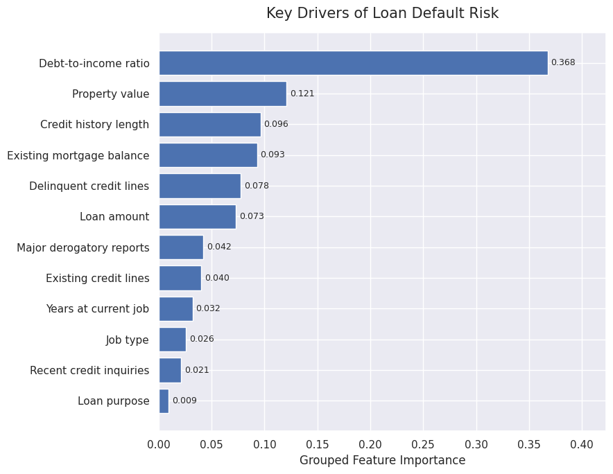
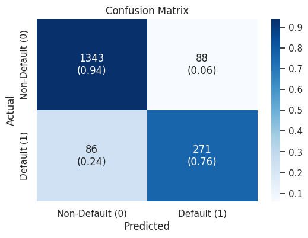

# Loan Default Prediction

A machine learning solution for identifying borrowers at risk of default on home equity loans, enabling more informed, consistent, and data-driven lending decisions.

---

## Overview

Lending institutions face the challenge of balancing business growth with credit risk. Approving high-risk applicants increases financial losses, while rejecting creditworthy borrowers reduces potential revenue and customer satisfaction.

This project develops and evaluates multiple machine learning classification models to predict loan default using borrower financial and credit characteristics. Beyond predictive performance, the project emphasizes model interpretability, allowing lending institutions to understand the factors influencing risk and support more transparent lending decisions.

<table>
<tr>
<td align="center"><b>Key Drivers of Loan Default</b></td>
<td align="center"><b>Random Forest Confusion Matrix</b></td>
</tr>

<tr>
<td></td>
<td></td>
</tr>
</table>

---

## Business Problem

Traditional loan approval processes often rely on manual underwriting, making them time-consuming and susceptible to inconsistent decisions.

The objective of this project is to build an interpretable classification model capable of identifying applicants who are likely to default on their loans while providing actionable insights into the factors that contribute most to credit risk.

---

## Objectives

* Explore borrower characteristics associated with loan default.
* Clean and prepare the dataset for predictive modeling.
* Develop multiple classification models.
* Compare model performance using business-relevant evaluation metrics.
* Identify the model that best balances precision and recall.
* Determine the borrower characteristics that contribute most to default risk.

---

## Dataset

The project uses **Home Equity (HMEQ)** dataset containing historical home equity loan applications.

Each observation represents a loan applicant and includes information such as:

* Loan amount
* Property value
* Existing mortgage balance
* Debt-to-income ratio
* Employment information
* Credit history
* Delinquency records
* Credit inquiries

The target variable is:

* **BAD**

  * **0:** Loan repaid
  * **1:** Loan defaulted or became seriously delinquent

---

## Exploratory Data Analysis

The exploratory analysis examined:

* Missing values
* Feature distributions
* Outliers
* Relationships between borrower characteristics and default
* Class imbalance
* Correlation between variables

These analyses guided preprocessing decisions and informed feature selection before model development.

---

## Modeling Approach

The following classification models were evaluated:

* Logistic Regression
* Decision Tree
* Tuned Decision Tree
* Random Forest
* Tuned Random Forest

Because predicting loan default is a business-critical classification problem, model evaluation focused on balancing:

* Precision
* Recall
* F1-score
* ROC-AUC

Threshold tuning was also performed to improve business performance beyond the default probability threshold of 0.50.

---

## Model Comparison

| Model               | Threshold |   Accuracy |  Precision |     Recall |   F1-score |    ROC-AUC |
| :------------------ | --------: | ---------: | ---------: | ---------: | ---------: | ---------: |
| Logistic Regression |      0.35 |     82.47% |     54.63% |     70.34% |     61.50% |     83.74% |
| Decision Tree       |      0.50 |     89.07% |     71.23% |     72.10% |     71.66% |     82.93% |
| Tuned Decision Tree |      0.50 |     90.10% |     73.95% |     73.95% |     73.95% |     84.98% |
| Random Forest       |  **0.37** | **90.27%** | **75.49%** | **75.91%** | **75.70%** | **94.96%** |
| Tuned Random Forest |      0.37 |     88.55% |     67.49% | **80.39%** |     73.38% |     94.26% |

The baseline Random Forest achieved the strongest overall balance between precision, recall, and overall discrimination, while the tuned Random Forest achieved the highest recall for identifying potential defaulters.

---

## Selected Model

The **Random Forest classifier with a classification threshold of 0.37** was selected as the final model because it provides the strongest balance between identifying high-risk borrowers and minimizing unnecessary false positives:

* Accuracy: **90.27%**
* Precision: **75.49%**
* Recall: **75.91%**
* F1-score: **75.70%**
* ROC-AUC: **94.96%**

The confusion matrix shows that the selected model correctly identifies the majority of both non-defaulting and defaulting borrowers while maintaining a balanced trade-off between false approvals and false rejections.

---

## Feature Importance

The Random Forest model provides insight into the variables contributing most to credit risk.

The most influential predictors include:

* Debt-to-income ratio
* Property value
* Age of the oldest credit line
* Existing mortgage balance
* Number of credit lines
* Loan amount

These variables capture both a borrower's current financial position and long-term credit behavior, making them valuable indicators of repayment risk.

---

## Business Insights

The analysis demonstrates that loan default is influenced by a combination of financial capacity and historical credit behavior rather than any single variable.

Key observations include:

* Borrowers with higher debt burdens generally exhibit greater default risk.
* Credit history remains one of the strongest indicators of future repayment behavior.
* Threshold optimization significantly improves business performance by increasing the model's ability to identify high-risk applicants.
* Random Forest models provide substantially stronger predictive performance than simpler linear models while maintaining useful interpretability through feature importance analysis.

---

## Recommendations

Financial institutions could use this model to:

* Prioritize manual review of high-risk applications.
* Support consistent and data-driven underwriting decisions.
* Reduce financial losses associated with loan defaults.
* Improve risk assessment while maintaining lending efficiency.
* Use feature importance to better understand the characteristics associated with elevated credit risk.

---

## Technologies Used

* Python
* Pandas
* NumPy
* Matplotlib
* Seaborn
* Scikit-learn
* Jupyter Notebook

---

## Future Improvements

Potential enhancements include:

* Evaluate gradient boosting methods such as XGBoost and LightGBM.
* Investigate cost-sensitive learning for imbalanced classification.
* Perform probability calibration.
* Incorporate explainability techniques such as SHAP values.
* Deploy the model as an interactive credit risk assessment application.
